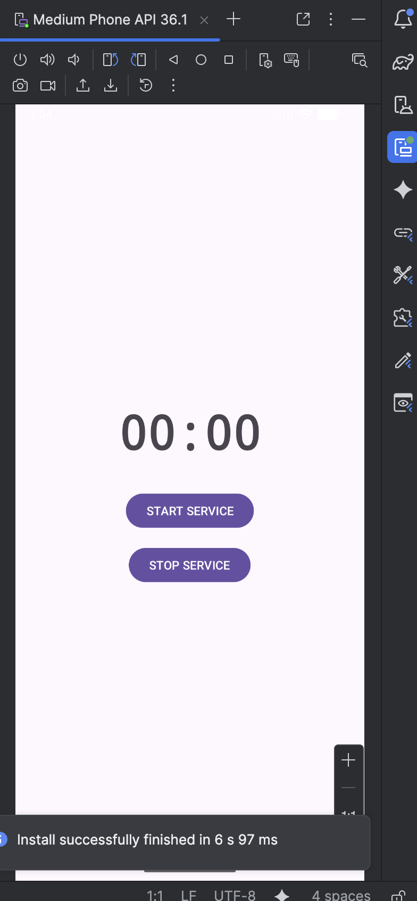
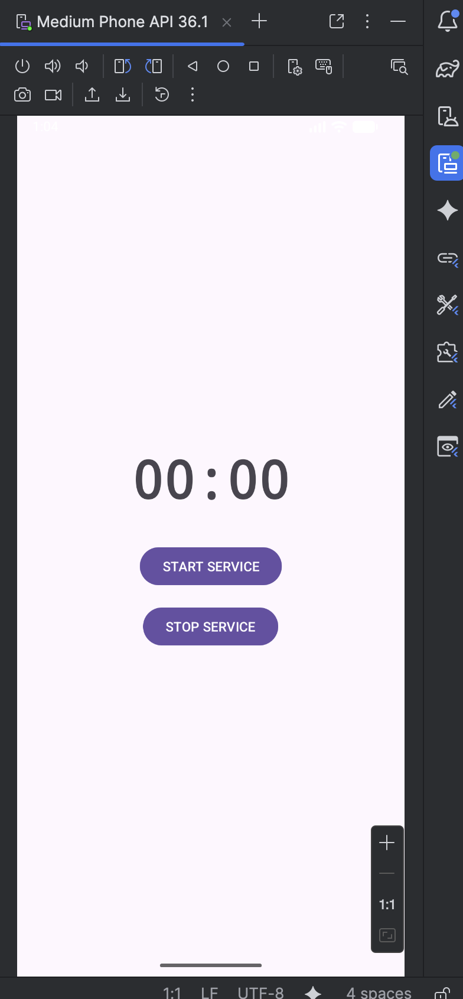

# LAB 16 – Service Chronomètre : Maîtriser les Services Android ⏱️

## Aperçu de l'application

Une application Android complète qui utilise un **Foreground Service** combiné à un **Bound Service** pour créer un chronomètre persistant. Le service continue de tourner même lorsque l'application est fermée, avec une notification en direct qui se met à jour chaque seconde. L'utilisateur peut démarrer et arrêter le chronomètre depuis l'interface de l'application.

| Écran initial | Chronomètre en marche | Service arrêté |
|---------------|----------------------|----------------|
|  |  |  |

## Fonctionnalités

- **Foreground Service** : service prioritaire avec notification persistante (obligatoire depuis Android 8.0)
- **Bound Service** : communication bidirectionnelle entre l'Activity et le Service
- **Notification en temps réel** : le temps affiché dans la notification se met à jour chaque seconde
- **Persistance** : le chronomètre continue de tourner même si l'utilisateur quitte l'application
- **START_STICKY** : le service redémarre automatiquement si le système le tue
- **Compatibilité Android** : respecte les restrictions des versions récentes (API 24+)
- **Mise à jour live du TextView** : l'affichage se synchronise en temps réel via Handler

## Architecture du projet

```
lab16_dev/
├── app/src/main/
│   ├── java/com.example.lab16_dev/
│   │   ├── ChronoService.java      (Foreground + Bound Service)
│   │   └── MainActivity.java       (Interface utilisateur)
│   ├── res/
│   │   └── layout/
│   │       └── activity_main.xml
│   └── AndroidManifest.xml
```

## Structure des composants

| Composant | Rôle |
|-----------|------|
| `ChronoService` | Service qui gère le chronomètre, la notification et le binding |
| `MainActivity` | Interface de contrôle (démarrer/arrêter) avec affichage live |
| `activity_main.xml` | Layout contenant TextView et deux boutons |
| `AndroidManifest.xml` | Déclaration du service + permission notifications |

## Code source complet

### 1. Manifest – `AndroidManifest.xml`

```xml
<?xml version="1.0" encoding="utf-8"?>
<manifest xmlns:android="http://schemas.android.com/apk/res/android"
    xmlns:tools="http://schemas.android.com/tools">

    <!-- Permission obligatoire pour les notifications sur Android 13+ -->
    <uses-permission android:name="android.permission.POST_NOTIFICATIONS"/>

    <application
        android:allowBackup="true"
        android:dataExtractionRules="@xml/data_extraction_rules"
        android:fullBackupContent="@xml/backup_rules"
        android:icon="@mipmap/ic_launcher"
        android:label="@string/app_name"
        android:roundIcon="@mipmap/ic_launcher_round"
        android:supportsRtl="true"
        android:theme="@style/Theme.Lab16_dev"
        tools:targetApi="31">
        
        <activity
            android:name=".MainActivity"
            android:exported="true">
            <intent-filter>
                <action android:name="android.intent.action.MAIN" />
                <category android:name="android.intent.category.LAUNCHER" />
            </intent-filter>
        </activity>
        
        <!-- Déclaration du service avec foregroundServiceType obligatoire depuis Android 14 -->
        <service
            android:name=".ChronoService"
            android:foregroundServiceType="dataSync"
            android:exported="false" />
            
    </application>

</manifest>
```

### 2. Layout – `res/layout/activity_main.xml`

```xml
<?xml version="1.0" encoding="utf-8"?>
<LinearLayout xmlns:android="http://schemas.android.com/apk/res/android"
    android:layout_width="match_parent"
    android:layout_height="match_parent"
    android:orientation="vertical"
    android:gravity="center"
    android:padding="24dp">

    <!-- Affichage du temps écoulé -->
    <TextView
        android:id="@+id/timeValue"
        android:layout_width="wrap_content"
        android:layout_height="wrap_content"
        android:text="00:00"
        android:textSize="56sp"
        android:textStyle="bold"
        android:fontFamily="monospace"/>

    <!-- Bouton pour démarrer le chronomètre -->
    <Button
        android:id="@+id/startControl"
        android:layout_width="wrap_content"
        android:layout_height="wrap_content"
        android:layout_marginTop="32dp"
        android:text="DÉMARRER LE SERVICE"
        android:textAllCaps="false"/>

    <!-- Bouton pour arrêter le chronomètre -->
    <Button
        android:id="@+id/stopControl"
        android:layout_width="wrap_content"
        android:layout_height="wrap_content"
        android:layout_marginTop="16dp"
        android:text="ARRÊTER LE SERVICE"
        android:textAllCaps="false"/>
        
</LinearLayout>
```

### 3. Service – `ChronoService.java`

```java
package com.example.lab16_dev;

import android.app.Notification;
import android.app.NotificationChannel;
import android.app.NotificationManager;
import android.app.Service;
import android.content.Context;
import android.content.Intent;
import android.os.Binder;
import android.os.Build;
import android.os.IBinder;

import androidx.annotation.Nullable;
import androidx.core.app.NotificationCompat;

import java.util.concurrent.Executors;
import java.util.concurrent.ScheduledExecutorService;
import java.util.concurrent.TimeUnit;

public class ChronoService extends Service {

    private final IBLocal binder = new IBLocal();
    
    private int elapsedSeconds = 0;      // Temps écoulé en secondes
    private boolean activeFlag = false;  // État du chronomètre
    private ScheduledExecutorService scheduledExecutor;  // Timer pour les secondes
    private static final int ALERT_ID = 2002;
    private NotificationManager notifManager;

    // Binder interne permettant à l'Activity de récupérer l'instance du service
    public class IBLocal extends Binder {
        public ChronoService retrieveService() {
            return ChronoService.this;
        }
    }

    @Override
    public void onCreate() {
        super.onCreate();
        notifManager = (NotificationManager) getSystemService(Context.NOTIFICATION_SERVICE);
        buildNotifChannel();  // Création du canal de notification (Android 8+)
    }

    @Override
    public int onStartCommand(Intent intent, int flags, int startId) {
        String actionCommand = (intent != null) ? intent.getAction() : null;

        // Action d'arrêt reçue depuis l'Activity
        if ("HALT".equals(actionCommand)) {
            stopSelf();
            return START_NOT_STICKY;
        }

        // Démarrage du service en mode Foreground si pas déjà actif
        if (!activeFlag) {
            activeFlag = true;
            startForeground(ALERT_ID, generateNotification());  // Obligatoire depuis Android 8
            launchTimer();
        }
        return START_STICKY;  // Redémarre auto si le système tue le service
    }

    private void launchTimer() {
        scheduledExecutor = Executors.newSingleThreadScheduledExecutor();
        scheduledExecutor.scheduleAtFixedRate(new Runnable() {
            @Override
            public void run() {
                elapsedSeconds++;
                refreshNotification();  // Mise à jour de la notification en direct
            }
        }, 0, 1, TimeUnit.SECONDS);
    }

    private void buildNotifChannel() {
        if (Build.VERSION.SDK_INT >= Build.VERSION_CODES.O) {
            NotificationChannel channel = new NotificationChannel(
                    "chronometer_channel_id",
                    "Timer Monitoring Service",
                    NotificationManager.IMPORTANCE_LOW
            );
            notifManager.createNotificationChannel(channel);
        }
    }

    private Notification generateNotification() {
        return new NotificationCompat.Builder(this, "chronometer_channel_id")
                .setContentTitle("Chronomètre en cours")
                .setContentText("Temps écoulé : " + formatDuration(elapsedSeconds))
                .setSmallIcon(android.R.drawable.ic_media_play)
                .setOngoing(true)          // Impossible à supprimer par l'utilisateur
                .setPriority(NotificationCompat.PRIORITY_LOW)
                .build();
    }

    private void refreshNotification() {
        notifManager.notify(ALERT_ID, generateNotification());
    }

    private String formatDuration(int seconds) {
        int minutesCount = seconds / 60;
        int remainingSecs = seconds % 60;
        return String.format("%02d:%02d", minutesCount, remainingSecs);
    }

    // Méthodes exposées à l'Activity via le Bound Service
    public int fetchCurrentTime() {
        return elapsedSeconds;
    }

    public boolean getOperationStatus() {
        return activeFlag;
    }

    @Nullable
    @Override
    public IBinder onBind(Intent intent) {
        return binder;  // Retourne le binder pour la connexion Activity-Service
    }

    @Override
    public void onDestroy() {
        activeFlag = false;
        if (scheduledExecutor != null) {
            scheduledExecutor.shutdown();
        }
        stopForeground(true);  // Supprime la notification persistante
        super.onDestroy();
    }
}
```

### 4. Activité principale – `MainActivity.java`

```java
package com.example.lab16_dev;

import android.content.ComponentName;
import android.content.Context;
import android.content.Intent;
import android.content.ServiceConnection;
import android.os.Build;
import android.os.Bundle;
import android.os.Handler;
import android.os.IBinder;
import android.view.View;
import android.widget.Button;
import android.widget.TextView;

import androidx.appcompat.app.AppCompatActivity;

public class MainActivity extends AppCompatActivity {

    private TextView timeDisplay;
    private Button launchButton, terminateButton;
    private ChronoService timerService;
    private boolean connectedFlag = false;
    private Handler uiHandler = new Handler();
    
    // Runnable qui met à jour l'affichage en temps réel (chaque seconde)
    private Runnable refreshRunnable = new Runnable() {
        @Override
        public void run() {
            if (connectedFlag && timerService != null && timerService.getOperationStatus()) {
                int currentSeconds = timerService.fetchCurrentTime();
                timeDisplay.setText(formatDisplay(currentSeconds));
                uiHandler.postDelayed(this, 1000);  // Se rappelle dans 1 seconde
            }
        }
    };

    // Connexion au Service (Bound Service)
    private final ServiceConnection serviceLink = new ServiceConnection() {
        @Override
        public void onServiceConnected(ComponentName name, IBinder service) {
            ChronoService.IBLocal localBinder = (ChronoService.IBLocal) service;
            timerService = localBinder.retrieveService();
            connectedFlag = true;
            uiHandler.post(refreshRunnable);  // Démarre la mise à jour live
        }

        @Override
        public void onServiceDisconnected(ComponentName name) {
            connectedFlag = false;
            timerService = null;
        }
    };

    @Override
    protected void onCreate(Bundle savedInstanceState) {
        super.onCreate(savedInstanceState);
        setContentView(R.layout.activity_main);

        timeDisplay = findViewById(R.id.timeValue);
        launchButton = findViewById(R.id.startControl);
        terminateButton = findViewById(R.id.stopControl);

        // DÉMARRER - lance le Foreground Service + s'y connecte
        launchButton.setOnClickListener(new View.OnClickListener() {
            @Override
            public void onClick(View v) {
                initiateTimer();
            }
        });

        // ARRÊTER - arrête le service et se déconnecte
        terminateButton.setOnClickListener(new View.OnClickListener() {
            @Override
            public void onClick(View v) {
                haltTimer();
            }
        });
    }

    private void initiateTimer() {
        Intent transferIntent = new Intent(this, ChronoService.class);
        // startForegroundService obligatoire sur Android 8+
        if (Build.VERSION.SDK_INT >= Build.VERSION_CODES.O) {
            startForegroundService(transferIntent);
        } else {
            startService(transferIntent);
        }
        bindService(transferIntent, serviceLink, Context.BIND_AUTO_CREATE);
    }

    private void haltTimer() {
        Intent haltIntent = new Intent(this, ChronoService.class);
        haltIntent.setAction("HALT");
        stopService(haltIntent);

        if (connectedFlag) {
            unbindService(serviceLink);
            connectedFlag = false;
            timerService = null;
        }
        timeDisplay.setText("00:00");
        uiHandler.removeCallbacks(refreshRunnable);
    }

    private String formatDisplay(int secondsValue) {
        int minsPortion = secondsValue / 60;
        int secsPortion = secondsValue % 60;
        return String.format("%02d:%02d", minsPortion, secsPortion);
    }

    @Override
    protected void onDestroy() {
        if (connectedFlag) {
            unbindService(serviceLink);
        }
        uiHandler.removeCallbacks(refreshRunnable);
        super.onDestroy();
    }
}
```

## Comment exécuter l'application

1. **Créer un projet** Android Studio avec "Empty Views Activity"
2. **Nom du projet** : `lab16_dev`
3. **Langage** : Java
4. **API minimum** : 24 (Android 7.0)
5. **Remplacer** `AndroidManifest.xml` par le code ci-dessus
6. **Remplacer** `activity_main.xml` par le code ci-dessus
7. **Créer** `ChronoService.java` avec le code fourni
8. **Remplacer** `MainActivity.java` par le code fourni
9. **Compiler** et exécuter sur émulateur (API 26+ recommandé) ou appareil physique

## Fonctionnement pas à pas

| Action | Résultat |
|--------|----------|
| **Lancement de l'app** | Écran affichant "00:00" avec deux boutons |
| **Clic sur "DÉMARRER LE SERVICE"** | Notification persistante apparaît + chrono tourne + TextView se met à jour chaque seconde |
| **Quitter l'application** | Le chrono continue en arrière-plan (notification toujours visible) |
| **Rouvrir l'application** | L'affichage se synchronise automatiquement avec le temps actuel |
| **Clic sur "ARRÊTER LE SERVICE"** | Chrono s'arrête, notification disparaît, TextView revient à "00:00" |

## Cycle de vie du Service

```
onCreate() → onStartCommand() → startForeground() → [Service actif] → onDestroy()
                                    ↓
                              START_STICKY
                         (redémarrage auto si tué)
```

## Points techniques abordés

| Concept | Implémentation |
|---------|----------------|
| **Foreground Service** | `startForeground()` avec notification obligatoire (Android 8+) |
| **Bound Service** | `ServiceConnection` + `IBinder` + `LocalBinder` |
| **START_STICKY** | Valeur retournée dans `onStartCommand()` |
| **Notification Channel** | `NotificationChannel` pour Android 8+ |
| **Notification en direct** | `notificationManager.notify()` appelé chaque seconde |
| **Timer sécurisé** | `ScheduledExecutorService` (alternative à Timer/Handler) |
| **Communication Service → Activity** | Handler + Runnable avec `postDelayed()` |
| **Permissions** | `POST_NOTIFICATIONS` pour Android 13+ |
| **foregroundServiceType** | `"dataSync"` obligatoire depuis Android 14 |

## Tests à effectuer ✅

- [x] Démarrer le service → notification apparaît
- [x] Chrono tourne → les secondes s'incrémentent
- [x] Quitter l'app → service continue (vérifier dans le tiroir de notifications)
- [x] Réouvrir l'app → TextView synchronisé avec le temps actuel
- [x] Arrêter le service → notification disparaît, TextView remis à zéro
- [x] Redémarrage automatique → START_STICKY fonctionnel

## Bonnes pratiques appliquées

- ✅ Notification avec `setOngoing(true)` → non supprimable par l'utilisateur
- ✅ Canal de notification avec `IMPORTANCE_LOW` → ne fait pas de son
- ✅ `onDestroy()` nettoie les ressources (executor.shutdown)
- ✅ `unbindService()` dans `onDestroy()` de l'Activity → pas de fuite mémoire
- ✅ `exported="false"` → protection contre d'autres applications
- ✅ Gestion des versions Android avec `Build.VERSION.SDK_INT`

---

**Auteur** : ELHEZZAM RANIA  
**Réalisé avec** : Android Studio sur MacOS Apple Silicon M2 (ARM-64 Native)  
